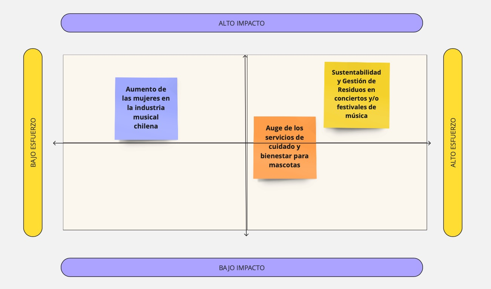

# Tarea 01 - Francisca Martínez

### 1. **Aumento de las mujeres en la industria musical urbana chilena** 

**Pros:**
- ¿Cómo evaluar el aumento de las mujeres en la industria? Reproducciones, seguidores, cantidad de shows o conciertos que ha realizado, colaboraciones con otros artistas, alcance de su música en el extranjero, etc.
- Podemos evuluar el éxito de las mujeres mediante varias variables: Reproducciones mediante Spotify o Youtube, Seguidores en Instagram, etc.
- Por lo que creemos que serían datos medianamente fáciles de obtener, existe una gran base de datos al respecto.

**Contras:**
- Sería difícil definir el año en que comenzó este aumento o auge de las mujeres en la indstria de la música urbana.
- Lograr encontrar datos duros previos, ya que es una industria medianamente actual y nueva, por lo que creemos que nos costaría encontrar datos de años anteriores.

### 2. **Sustentabilidad y Gestión de Residuos en conciertos y/o festivales de música**

**Pros:**
- Se pueden medir variables como la cantidad de residuos generados, tasas de reciclaje, y la implementación de políticas de sostenibilidad (uso de energía renovable, reducción de plásticos).
- Muchos conciertos y festivales ahora publican sus políticas de sustentabilidad y los resultados de sus esfuerzos de reducción de residuos.
- Es un tema que destaca la importancia de minimizar el impacto ambiental de eventos masivos.

**Contras:**
- No todos los concierto y festivales publican información detallada sobre sus prácticas ambientales, lo que puede limitar la comparabilidad.
- La eficacia de las políticas de sustentabilidad puede variar ampliamente entre conciertos y festivales, lo que complica el análisis de su impacto real.

### 3. **Auge de los servicios de cuidado y bienestar para mascotas**

**Pros:**
- Se pueden analizar variables como el crecimiento del número de empresas de cuidado de mascotas, el aumento en la demanda de servicios como guarderías, paseos, peluquería y salud mental, y el gasto promedio por hogar en estos servicios.
- Hay estudios de mercado, encuestas a dueños de mascotas y datos de empresas del sector que documentan el rápido crecimiento de la industria del cuidado y bienestar de mascotas.
Este tema refleja un cambio en las dinámicas urbanas, donde las mascotas se consideran miembros importantes de la familia, impulsando una industria en expansión que responde a sus necesidades de bienestar.

**Contras:**
- El mercado incluye una gran cantidad de pequeños proveedores o emprendedores, lo que podría dificultar la consolidación de datos a nivel general.
- Algunas áreas específicas del cuidado de mascotas, como la salud mental o el bienestar emocional, pueden tener menos datos disponibles debido a la novedad de estos servicios.

## **Matriz impacto x esfuerzo**

# Conclusiones del Miro

**Auge de los Servicios de Cuidado y Bienestar para Mascotas - Medio Impacto / Alto Esfuerzo:**

- Este tema refleja una tendencia creciente y un cambio cultural en la forma en que las personas cuidan a sus mascotas, especialmente en entornos urbanos.
- Existen datos de mercado y estudios de consumo que son accesibles, aunque algunos servicios emergentes pueden tener menos información disponible.
- Aunque es un tema de media-alta relevancia, el esfuerzo, aunque no excesivo, puede ser considerable dependiendo de la disponibilidad y fragmentación de los datos.

**Sustentabilidad y Gestión de Residuos en Conciertos y/o Festivales de Música - Alto Impacto / Alto Esfuerzo:**

- Este tema tiene un alto impacto en las personas pero requiere un esfuerzo considerable, lo que lo convierte en un proyecto desafiante pero muy valioso.
- La sustentabilidad es un tema crítico a nivel global, y la gestión de residuos en eventos masivos tiene un impacto directo en el medio ambiente.
- Respecto al esfuerzo, aunque existen datos, estos pueden variar ampliamente entre festivales y requerirán un esfuerzo considerable para consolidar y comparar.
- Involucra múltiples factores, desde el tipo de residuos hasta las políticas de reciclaje, lo que puede hacer que el análisis sea complejo.

**Aumento de las Mujeres en la Industria Musical Urbana Chilena - Alto Impacto / Medio Esfuerzo:** 

- Este tema tiene un alto impacto, ya que es un tema relevante en el contexto por la lucha de la equidad género y tiene un gran intéres social y mediático. Además que existe un creciente interés en la visibilidad y representación de las mujeres en industrias dominadas históricamente por hombres.
- Respecto al esfuerzo, la recopilación de datos podría requerir una combinación de fuentes, incluidas bases de datos musicales y/o estudios de la industria. Además definir métricas específicas y realizar un análisis exhaustivo podría ser un poco complejo debido a la naturaleza cualitativa del tema.
- Pero seria el proyecto que mejor se ubica de los cuadrantes.

